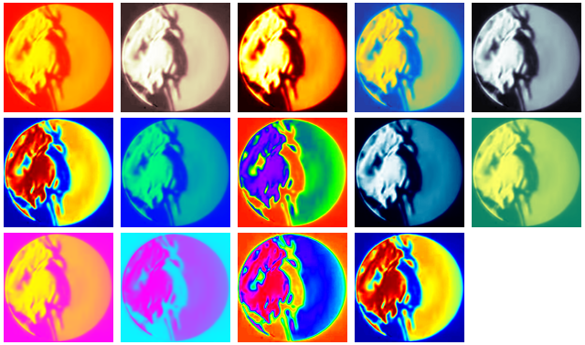

# recolor.py

Converts the color scheme of an rgb video to a new color map. Designed to process and colorize Schlieren effect videos.




### setup

ensure you have python2.7 and virtualenv installed

* [install python2.7](https://www.python.org/downloads/)
* [install pip](https://pip.pypa.io/en/stable/installing/)
* `pip install virtualenv`

one these requirements are handled run the below code to set up a 
virtual-environment with all needed requirements 

```
virtualenv venv --python=python2.7
source venv/bin/activate
pip install -r requirements.txt
```

# run

like this:

`python recolor.py --input test.mp4 --output out.mp4 --color 5 --window True`

this will read from test.mp4, show a video on the screen using the colorscheme OCEAN, and save the output to out.mp4

you can use `python recolor.py -h` to see help

# about 


```
usage: recolor.py [-h] --input INPUT [--output OUTPUT] [--color COLOR]
                  [--window WINDOW]

optional arguments:
  -h, --help       show this help message and exit
  --input INPUT    input file like input.mp4 (default: None)
  --output OUTPUT  output file like output.mp4 (default: None)
  --color COLOR    color theme choice, 0-11 0 cv2.COLORMAP_AUTUMN 1
                   cv2.COLORMAP_BONE 2 cv2.COLORMAP_JET 3 cv2.COLORMAP_WINTER
                   4 cv2.COLORMAP_RAINBOW 5 cv2.COLORMAP_OCEAN 6
                   cv2.COLORMAP_SUMMER 7 cv2.COLORMAP_SPRING 8
                   cv2.COLORMAP_COOL 9 cv2.COLORMAP_HSV 10 cv2.COLORMAP_PINK
                   11 cv2.COLORMAP_HOT (default: 2)
  --window WINDOW  show a window with the video (default: True)
```

